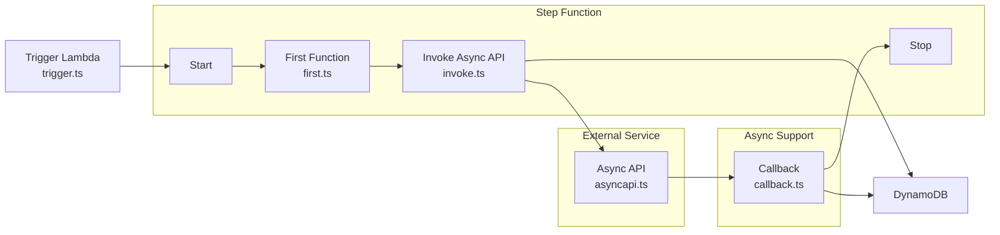

## Deployment
`cd functions && npm i && npm run compile && cd .. && sam build && sam deploy`

## Cleanup
`sam delete`

## Flow

```mermaid
  flowchart LR
    Trigger[Trigger Lambda<br/>trigger.ts] --> Start[Start]
    subgraph Step[Step Function]
      Start --> First[First Function<br/>first.ts]
      First --> Invoke[Invoke Async API<br/>invoke.ts]
      Stop
    end
    Invoke --> DynamoDB
    Invoke --> AsyncAPI
    subgraph Async[Async Support]
      Callback[Callback<br/>callback.ts] --> Stop
    end
    subgraph External[External Service]
      AsyncAPI[Async API<br/>asyncapi.ts] --> Callback
    end
    Callback --> DynamoDB
    
```
